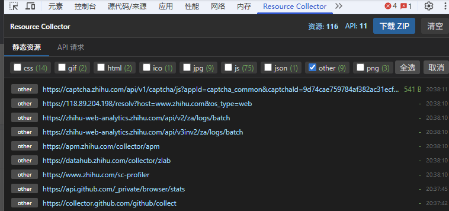

# Resource Collector

一个用于收集网页静态资源和 API 请求的 Chrome 浏览器扩展。



## 功能特性

- **静态资源收集**：自动捕获网页加载的所有静态资源（JS、CSS、图片、字体、3D 模型等）
- **API 请求记录**：记录所有 XHR/Fetch 请求，包含请求参数和响应内容
- **多格式支持**：支持 30+ 种文件格式，包括 gzip、glb、gltf、3ds、wasm 等
- **类型筛选**：下载前可按文件类型筛选，勾选需要的资源类型
- **一键打包**：将所有资源打包成 ZIP 文件下载
- **结构化日志**：生成 Markdown 格式的资源清单和 API 请求记录

## 安装方法

1. 下载本项目到本地
2. 打开 Chrome 浏览器，进入 `chrome://extensions/`
3. 开启右上角的「开发者模式」
4. 点击「加载已解压的扩展程序」
5. 选择本项目文件夹

## 使用说明

### 收集资源

1. 打开需要收集资源的网页
2. 按 `F12` 打开 DevTools
3. 切换到 **Resource Collector** 面板
4. 刷新页面或进行页面操作，资源会自动被收集


### 下载资源

1. 点击浏览器工具栏的扩展图标打开 Popup
2. 勾选需要下载的资源类型（默认全选）
3. 点击「下载 ZIP」按钮
4. 选择保存位置

### ZIP 包内容

```
resources_20241225_1430.zip
├── resources/
│   ├── js/
│   │   └── *.js
│   ├── css/
│   │   └── *.css
│   ├── png/
│   │   └── *.png
│   └── ...
├── resources-log.md      # 资源获取记录
└── api-requests.md       # API 请求记录
```

## 支持的资源类型

| 类别 | 格式 |
|------|------|
| 脚本 | js |
| 样式 | css |
| 图片 | png, jpg, jpeg, gif, svg, webp, ico, bmp |
| 字体 | woff, woff2, ttf, otf, eot |
| 3D 模型 | glb, gltf, 3ds |
| 压缩文件 | gzip, zip |
| 音视频 | mp3, mp4, webm, ogg, wav |
| 其他 | json, xml, wasm, pdf |

## 技术栈

- Chrome Extension Manifest V3
- Chrome DevTools Protocol
- JSZip

## 许可证

MIT License
